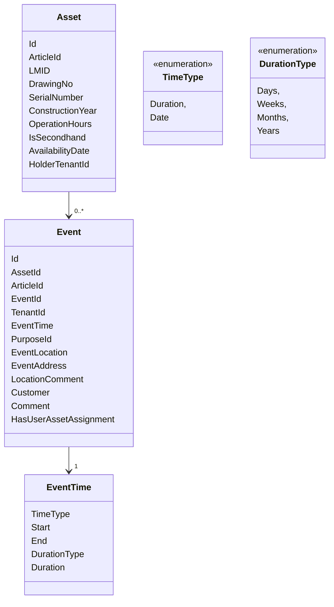

- [About this file](#about-this-file)
- [Entities](#entities)
  - [Properties description](#properties-description)
- [Task 1 - Event Time buisness rule](#task-1---event-time-buisness-rule)
- [Task 2 - Implement Event Status](#task-2---implement-event-status)
- [Task 3 - Implement command to create an event for an asset](#task-3---implement-command-to-create-an-event-for-an-asset)

# About this file

To read the information in this file, use your preferred markdown viewer. The mermaid-code can be viewed with eg. [mermaid-js](https://mermaid-js.github.io/mermaid-live-editor/)

# Entities

## Properties description

- EventTime
  - Start
  The start datetime of the event (user input)
  - End
  The end datetime of the event (user input)
  - TimeType
  Describes the type of time range for current event, there are two possibility "Date" and "Duration"
  - DurationType
  Describes the duration measurements, possible values Days, Weeks, Months, Years
  - Duration
  Describes the duration itself, this is numeric value, ex: 1 (user input)

# Task 1 - Event Time buisness rule

The "EventTime" needs the following business rule:

- TimeType = Date
Start and End must be set. DurationType and Duration are null
- TimeType = Duration
DurationType and Duration are set. Start and End are null

# Task 2 - Implement Event Status

Add another property to entity "Event" called "EventStatus".

There are bussiness rules for each status:

| Term | Bussiness rule |
|--|--|
| Shortage Event | TimeType = Date && AssetId = NULL && EventId != NULL |
| Active Event | TimeType = Date && AssetId != NULL && EventId != NULL |
| Pending Event | TimeType = Duration && AssetId = NULL && EventId != NULL|

# Task 3 - Implement command to create an event for an asset

An asset can have many events in different date-periods.
Only one user can create an event for an asset, for a specified time-range. (TimeType = Date, time-range between start and end)
In case only the "Duration"-TimeType is selected, the event can be created without checks for overlapping events.
Make sure, that in case of two users, creating an event for the same asset, the event is only created for one of them. The second user should get conflict response.
Implemented functionality shall be covered by unit tests.
